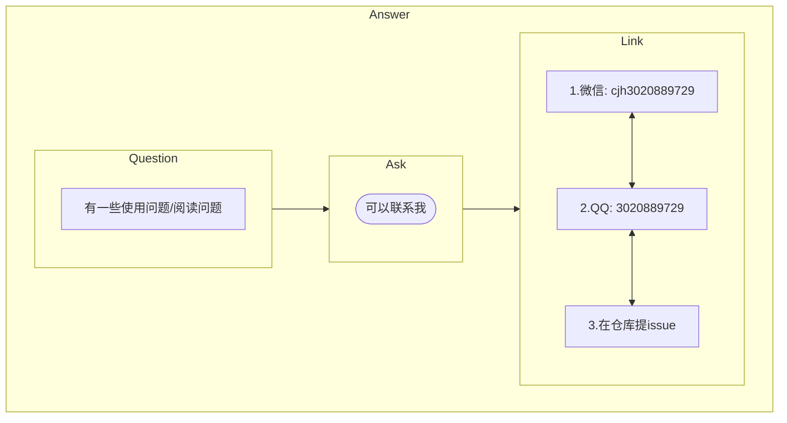

Docsify Tutorial<small>0.1</small>

> 一个简单的docsify文档上手教程(学习笔记)

- 一、安装Docsify
  - [安装Node.js](./zh-cn/安装Node_js): `docsify`所依赖的安装环境
    - Update Date: _2022.1.19_
  - [npm下载docsify](./zh-cn/npm下载docsify): 通过`npm`下载`docsify`工具
    - Update Date: _2022.1.19_

* 二、快速构建First Doc
  * [初始化构建](./zh-cn/初始化构建): 构建一个最基本的`doc`结构
    * Update Date: _2022.1.20_
  * [解析index.html](./zh-cn/解析html "Docsify Tutorial"): 介绍index.html的基本使用/功能
    * Update Date: _2022.1.20_
  * [解析README.md](./zh-cn/解析README "Docsify Tutorial"): 编写第一个文档页面
  * [添加侧边栏](./zh-cn/添加侧边栏): 为`doc`添加`侧边栏`，便捷浏览整个文档
  * [完善侧边栏内容](./zh-cn/完善侧边栏内容 "Docsify Tutorial"): 添加多个文档页面，丰富文档内容
  * [添加导航栏](./zh-cn/添加导航栏): 为`doc`添加`导航栏`，快速浏览常用内容
  * [导航栏里的链接](./zh-cn/导航栏里的链接 "Docsify Tutorial"): 导航栏跳转外部链接
  * [添加搜索栏](./zh-cn/添加搜索栏): 为`doc`添加`搜索`，快速搜索文档所需`链接`内容
* 三、添加常用插件
  * [字数统计](./zh-cn/字数统计): 统计当前页面(md)所含`字数`以及`大概阅读时间`
    * Update Date: _2022.1.20_
  * [代码高亮](./zh-cn/代码高亮): 针对`不同语言代码`进行高亮，方便语法阅读
    * Update Date: _2022.1.20_
  * [代码复制](./zh-cn/代码复制): 支持复制`文本代码格式`，方便复制粘贴代码内容
  * [支持Mermaiid](./zh-cn/支持Mermaid): 支持`Markdown`中的`Mermaid`绘图插件

- 四、高阶应用
  - [Github-Pages文档部署](./zh-cn/Pages文档部署): 将本地文档部署到互联网，方便实时浏览

> 如果有文档撰写问题，可以浏览右上角的`文档撰写资料`哦~

