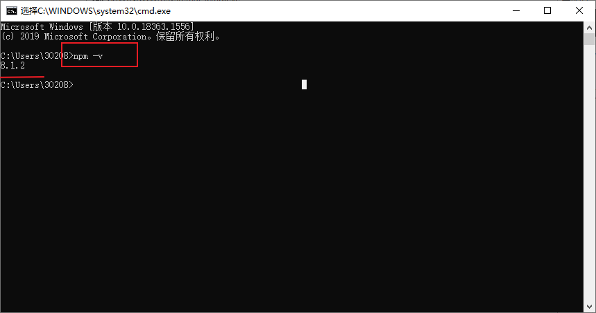
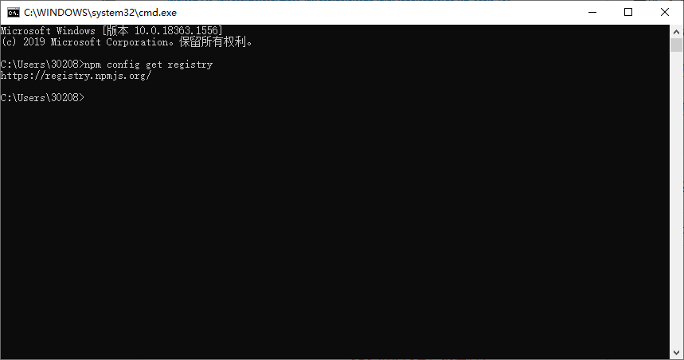

## 1.npm版本查看

> 当前测试版本可以直接利用`npm`进行下载，如果遇到**版本不支持**，可以进行`npm`更新哦~

可以在之前的黑框框里输入`npm -v`进行`npm`的版本查看~



提醒一下，如果遇到回车(`Enter`)之后卡住没有输出，可以按下`Ctrl+C`，它就会提前退出命令状态直接返回**版本信息**。

## 2.npm换国内源

接下来为了方便下载，国内的伙伴们需要换一下源(镜像)，否则下载可能会比较慢。

持久换源指令: `npm config set registry https://registry.npm.taobao.org`

临时换源指令: `npm --registry https://registry.npm.taobao.org install express`

> PS: 持久还源，一次到位，以后下载都会默认从`淘宝镜像`下载。

换好源之后，我们可以用以下指令确定`npm`是否换成`目标源`。(我这里还没有换源)

```bash
npm config get registry
```



## 3.npm下载docsify

以上步骤完成，我们就可以愉快的下载`docsify`啦~

```bash
# 下载 docsify -- 全局安装
npm i docsify-cli -g
```

> 以上指令会自动安装部署`docsify`