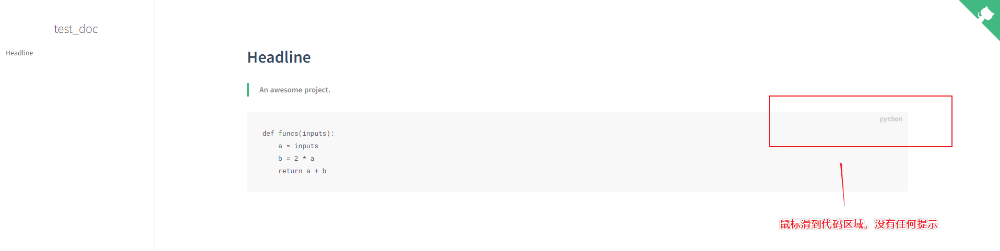
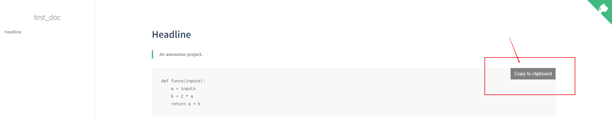

<center><font size=32>为文档添加代码复制功能</font></center>

## 1.功能介绍


`docsify`基于本地的`Markdown`文件进行实时网页文档浏览的效果。当进行`Markdown`中的`Code Block`进行渲染后，往往只是单纯的代码文本。但是我们对于代码部分的展示时，有时候需要对文档代码进行验证又或者实践文档代码进行测试，这时候手动复制显得不那么友善，`Code Block`一多工作量就大了——这时候如果对于每个代码块有一个一键复制的功能就好了~

功能表单:

- 支持Markdown文档的所有代码块([什么是代码块](https://www.runoob.com/markdown/md-code.html `target: _blank`))
- 每个代码块右上角提供`一键复制按钮`(**Copy to clipboard**)

## 2.插件所需script

插件链接如下:

```html
<script src="//cdn.jsdelivr.net/npm/docsify-copy-code/dist/docsify-copy-code.min.js"></script>
```


## 3.为文档添加script

我们知道所需的**插件script**之后，我们就可以直接添加到`index.html`中，开启相应的功能啦~

我们插入位置为`index.html`尾部:

```html
<!-- Docsify v4 -->
  <script src="//cdn.jsdelivr.net/npm/docsify@4"></script>
  <script src="//cdn.jsdelivr.net/npm/docsify-copy-code/dist/docsify-copy-code.min.js"></script>
</body>
</html>
```

我们可以先看一下，未插入**复制插件**前的`python`代码块情况:

- 在`README.md`文件中写入以下`Markdown`语法(代码块):

  - ```markdown
    ​```python
    def funcs(inputs):
        a = inputs
        b = 2 * a
        return a + b
    ​```
    ```

    效果展示:

    

- **插入复制插件后的效果:**

  


## 修改后的完整代码

`index.html`中的完整代码:

```html
<!DOCTYPE html>
<html lang="en">
<head>
  <meta charset="UTF-8">
  <title>test_doc</title>
  <meta http-equiv="X-UA-Compatible" content="IE=edge,chrome=1" />
  <meta name="description" content="Description">
  <meta name="viewport" content="width=device-width, initial-scale=1.0, minimum-scale=1.0">
  <link rel="stylesheet" href="//cdn.jsdelivr.net/npm/docsify@4/lib/themes/vue.css">
</head>
<body>
  <div id="app"></div>
  <script>
    window.$docsify = {
      name: 'test_doc',
      repo: 'http://www.baidu.com/',
    }
  </script>
  <!-- Docsify v4 -->
  <script src="//cdn.jsdelivr.net/npm/docsify@4"></script>
  <script src="//cdn.jsdelivr.net/npm/docsify-copy-code/dist/docsify-copy-code.min.js"></script>
</body>
</html>
```

`README.md`中的完整内容:

```markdown
# Headline

> An awesome project.


​```python
def funcs(inputs):
    a = inputs
    b = 2 * a
    return a + b
​```
```

