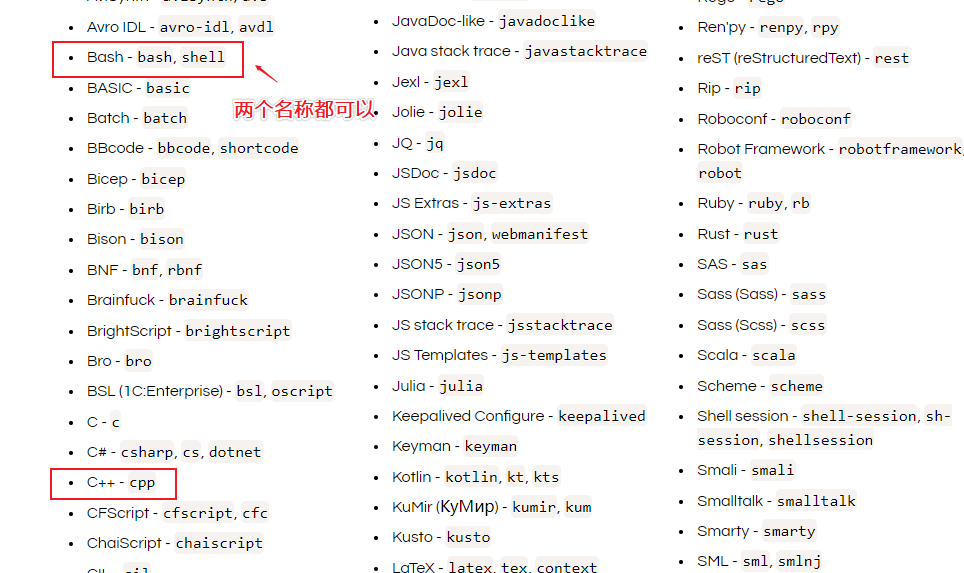
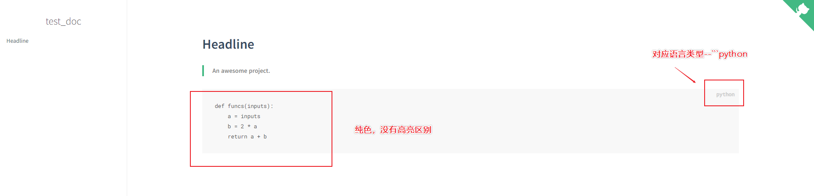
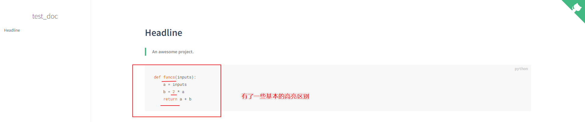

<center><font size=32>为文档添加代码高亮功能</font></center>

## 1.功能介绍

技术文档除了一些必要的介绍，使用说明外，必不可少的有一些代码部分要展示——这时候我们就可能展示多种多样的代码，比如**c、cpp、python、java、bash、html、js、css**等。但是在展示这些代码的时候，我们在本地端使用的一些**编程IDE**存在着代码高亮的功能，也就是对于代码文件中，不同部分用于不同的颜色高亮表示，以区分内容，方便阅读——比如，**数字**、**关键字**、**函数**等用不同的颜色区分。

对于docsify的渲染而言，默认支持以下的代码高亮:(基于<a href="https://prismjs.com/" target="_blank">Prism</a>渲染)

- **标记** - `markup`, `html`, `xml`, `svg`, `mathml`, `ssml`, `atom`,`rss`
- **CSS** - `css`
- **类 C** - `clike`
- **JavaScript** - `javascript`,`js`

功能表单:

- 支持多样的编程语言高亮情况
  - 支持的代码: [Prism高亮支持的语言](https://prismjs.com/#supported-languages ': target=_blank')

## 2.插件所需script

由于我们往往不是需要文档对所有的代码都高亮，因此只需要我们所期望高亮的语言对应的**插件script**就好啦！

这里举个例子，添加`bash`、`python`、`cpp`的高亮配置:

```html
<script src="//cdn.jsdelivr.net/npm/prismjs@1/components/prism-bash.min.js"></script>
<script src="//cdn.jsdelivr.net/npm/prismjs@1/components/prism-python.min.js"></script>
<script src="//cdn.jsdelivr.net/npm/prismjs@1/components/prism-cpp.min.js"></script>
```

其它的语言高亮支持，只需要在上面的 [Prism高亮支持的语言](https://prismjs.com/#supported-languages ': target=_blank')中找到你需要的语言的名称:(如下图)



找到所需语言右侧对应的名称后，替换以下语句中的`xxxx`即可得到对应的**插件script**:

替换前:

```html
<script src="//cdn.jsdelivr.net/npm/prismjs@1/components/prism-xxxx.min.js"></script>
```

**替换为cpp的插件**:

```html
<script src="//cdn.jsdelivr.net/npm/prismjs@1/components/prism-cpp.min.js"></script>
```

## 3.为文档添加script


我们知道所需的**插件script**之后，我们就可以直接添加到`index.html`中，开启相应的功能啦~

我们插入位置为`index.html`尾部:

```html
<!-- Docsify v4 -->
  <script src="//cdn.jsdelivr.net/npm/docsify@4"></script>
  <script src="//cdn.jsdelivr.net/npm/prismjs@1/components/prism-bash.min.js"></script>
  <script src="//cdn.jsdelivr.net/npm/prismjs@1/components/prism-python.min.js"></script>
  <script src="//cdn.jsdelivr.net/npm/prismjs@1/components/prism-cpp.min.js"></script>
</body>
</html>
```

我们可以先看一下，未插入高亮插件前的python代码情况:

- 在README.md文件中写入以下Markdown语法(代码块):

  - ```markdown
    ​```python
    def funcs(inputs):
        a = inputs
        b = 2 * a
        return a + b
    ​```
    ```

    效果展示:

    

**插入高亮插件script之后的效果**:



## 修改后的完整代码

`index.html`中的完整代码:

```html
<!DOCTYPE html>
<html lang="en">
<head>
  <meta charset="UTF-8">
  <title>test_doc</title>
  <meta http-equiv="X-UA-Compatible" content="IE=edge,chrome=1" />
  <meta name="description" content="Description">
  <meta name="viewport" content="width=device-width, initial-scale=1.0, minimum-scale=1.0">
  <link rel="stylesheet" href="//cdn.jsdelivr.net/npm/docsify@4/lib/themes/vue.css">
</head>
<body>
  <div id="app"></div>
  <script>
    window.$docsify = {
      name: 'test_doc',
      repo: 'http://www.baidu.com/',
    }
  </script>
  <!-- Docsify v4 -->
  <script src="//cdn.jsdelivr.net/npm/docsify@4"></script>
  <script src="//cdn.jsdelivr.net/npm/prismjs@1/components/prism-bash.min.js"></script>
  <script src="//cdn.jsdelivr.net/npm/prismjs@1/components/prism-python.min.js"></script>
  <script src="//cdn.jsdelivr.net/npm/prismjs@1/components/prism-cpp.min.js"></script>
</body>
</html>
```

README.md中的完整内容:

```markdown
# Headline

> An awesome project.


​```python
def funcs(inputs):
    a = inputs
    b = 2 * a
    return a + b
​```
```


