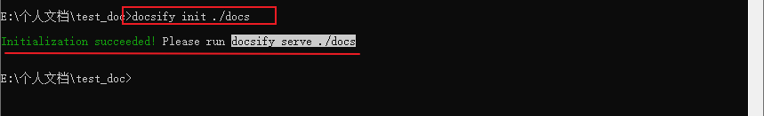
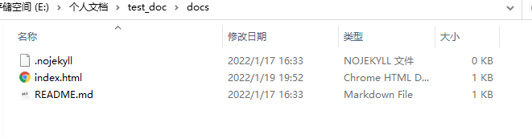
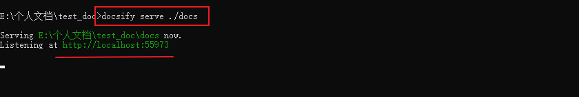
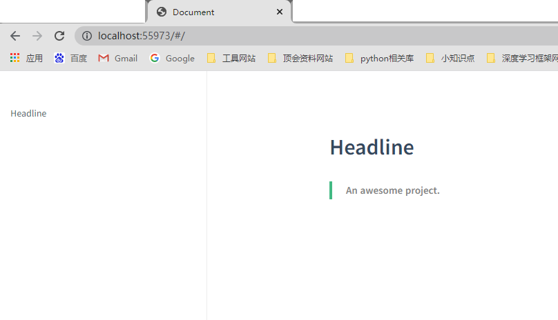

## 1.构建文档空间

前面，我们完成了`docsify`的下载，这部分我们将利用`docsify`进行**文档的创建**以及**基本的配置**，从而方便后期我们进行静态文档的**编写与阅读**。

首先，我们了解以下如何创建一个`docsify文档`。

> PS: 输入以下指令即可创建`docs`文档目录

```bash
# docsify: 工具的名称
# init: 工具执行的功能指令--初始化创建一个文档
# ./docs: 表示在当前目录进行初始化创建
# 综上: 在当前目录创建了一个docs文件夹作为文档目录
docsify init ./docs
```

输入**初始化指令**



初始化后的**目录结构**


`docs`中的初始化文件



> 我们在后边去介绍这三个文件的作用~，这里只需要知道这三个文件是初始化生成的就可以了

## 2.启动docsify服务

我们尝试着运行一下我们现在初始化后的文档，可以看到最初的文档效果~

在当前目录下运行指令`docsify serve ./docs`从而启动文档渲染服务，从而进行文档预览。

> - `serve`: 启动服务的指令
> - `./docs`: 以指定路径为文档路径进行服务



执行服务指令后, 可以通过浏览器输入上边的: `http://localhost:55973`

> 上边类似网址一样的，是`docsify`服务所使用的服务端口，只有通过这里才能访问我们当前编写的这个文档。
>
> 服务端口一般为`3000`这些，但是**不是一成不变的**——当我们同时启动多个docsify服务，开启多个文档服务时，就会有**多个不同**的端口被被调用。

这是输入**当前的服务端口**后的效果。




上面浏览器所显示的内容其实是初始化文档目录中的README.md内容~

> PS: `docsify`一个优势就是利用本地目录中的一些`Markdown文件`生成相应的**静态文档**，但是由于是**实时渲染**，不会产生html文件等。

**后面，我们还将学习怎么去添加文档的内容以及一些常用插件~**

不过，在这一节，我们还需要再深入了解一下**文档结构**，以方便我们后边进行**文档组织**。

## 3.基本文档结构

- 待更新