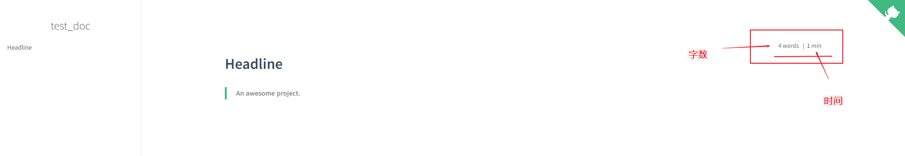
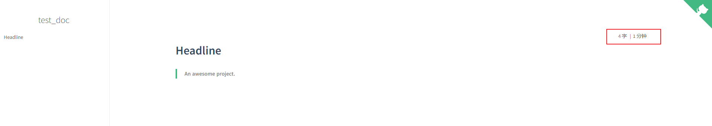

<center><font size=32>为文档添加字数统计功能</font></center>

## 1. 功能介绍

有时候，在阅读文档文章时我们可能会考虑到文档有多长，读完需要花多少时间——而这样的一个功能就是这节要介绍的字数统计功能。

**功能表单:**

- 在右上角显示当前文章**字数**/**单词数**
- 在右上角显示当前文章**阅读时间**
- 支持统计信息**中文(`chinese`)**/英文

## 2.插件所需script


插件链接如下:

```html
<script src="https://cdn.jsdelivr.net/npm/docsify-count@latest/dist/countable.min.js"></script>
```


> PS: 无需下载源码，直接就可使用~

## 3.为文档添加script

接下我们要将上边的插件链接添加到我们的文档目录中的`index.html`文件中，并做一些配置来**开启字数统计功能**。

我们先看一下未开启该功能的`index.html`文件内容:

```html
<!DOCTYPE html>
<html lang="en">
<head>
  <meta charset="UTF-8">
  <title>test_doc</title>
  <meta http-equiv="X-UA-Compatible" content="IE=edge,chrome=1" />
  <meta name="description" content="Description">
  <meta name="viewport" content="width=device-width, initial-scale=1.0, minimum-scale=1.0">
  <link rel="stylesheet" href="//cdn.jsdelivr.net/npm/docsify@4/lib/themes/vue.css">
</head>
<body>
  <div id="app"></div>
  <script>
    window.$docsify = {
      name: 'test_doc',
      repo: 'http://www.baidu.com/'
    }
  </script>
  <!-- Docsify v4 -->
  <script src="//cdn.jsdelivr.net/npm/docsify@4"></script>
</body>
</html>
```

我们看着最后:

```html
<!-- Docsify v4 -->
  <script src="//cdn.jsdelivr.net/npm/docsify@4"></script>
</body>
</html>
```

我们将字数统计的插件链接添加到`<script src="//cdn.jsdelivr.net/npm/docsify@4"></script>`的**下一行**。

```html
<!-- Docsify v4 -->
  <script src="//cdn.jsdelivr.net/npm/docsify@4"></script>
  <script src="https://cdn.jsdelivr.net/npm/docsify-count@latest/dist/countable.min.js"></script>
</body>
</html>
```

> 以后还要继续添加的插件也都放到这后边就可以了哦~

现在，添加了这一行之后，我们来看一下效果:



可以发现统计的字数时，按照的是**英语单词**来统计的，但是统计信息是**英文**的。这时候我们还需要配置才能实现**中文**的统计信息展示~

配置前，如下:

```html
<script>
    window.$docsify = {
      name: 'test_doc',
      repo: 'http://www.baidu.com/',
    }
</script>
```

**配置后**，如下:

```html
<script>
    window.$docsify = {
      name: 'test_doc',
      repo: 'http://www.baidu.com/',
	  count:{
              countable:true,
              fontsize:'0.9em',
              color:'rgb(90,90,90)',
              language:'chinese'
        }
    }
</script>
```

效果如下:



大家也可以修改`count`配置里的参数进行修改:

- `countable`: 是否开启统计
- `fontsize`: 统计信息展示的**字体大小**
- `color`: 统计信息展示的**字体颜色**
- `language`: 统计信息展示的**语言类型**

## 修改后的完整代码

为了方便大家使用，这里直接将整体的修改代码粘贴在这里:

```html
<!DOCTYPE html>
<html lang="en">
<head>
  <meta charset="UTF-8">
  <title>test_doc</title>
  <meta http-equiv="X-UA-Compatible" content="IE=edge,chrome=1" />
  <meta name="description" content="Description">
  <meta name="viewport" content="width=device-width, initial-scale=1.0, minimum-scale=1.0">
  <link rel="stylesheet" href="//cdn.jsdelivr.net/npm/docsify@4/lib/themes/vue.css">
</head>
<body>
  <div id="app"></div>
  <script>
    window.$docsify = {
      name: 'test_doc',
      repo: 'http://www.baidu.com/',
	  count:{
              countable:true,
              fontsize:'0.9em',
              color:'rgb(90,90,90)',
              language:'chinese'
        }
    }
  </script>
  <!-- Docsify v4 -->
  <script src="//cdn.jsdelivr.net/npm/docsify@4"></script>
  <script src="https://cdn.jsdelivr.net/npm/docsify-count@latest/dist/countable.min.js"></script>
</body>
</html>
```