## 1.添加侧边栏内容

> 这里**侧边栏的内容** == `RADEME.md`中的`一级`、`二级`等标题。
>
> 不过这些选项都是由**`列表`**渲染得到的。

接下来，我们向`_sidebar.md`文件中写入以下内容:

```markdown
- 第一篇文档
- 第二篇文档
- 第三篇文档
```

我们看下服务启动后的效果:

```bash
docsify serve docs
```

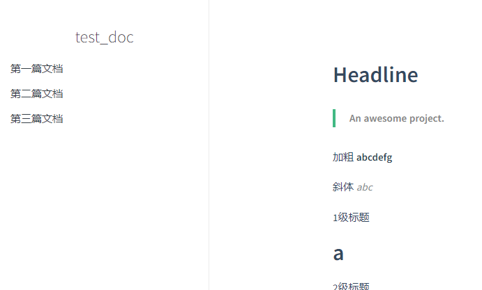


从上边效果可以看出，添加具体内容后，侧边栏不再默认渲染`README.md`中的内容。

接下来， 介绍一下侧边栏的配置规则~

## 2.侧边栏配置规则

前面示例也提到过，侧边栏的渲染是根据`_sidebar.md`中的**列表单元**来配置的；因此，具体规则总结如下:

```markdown
- 第一篇文档(一级侧边标题)
	- 章节1(二级侧边标题)
	- 章节2(二级侧边标题)
- 第二篇文档(一级侧边标题)
	- 章节1(二级侧边标题)
	- 章节2(二级侧边标题)
- 第三篇文档(一级侧边标题)
	- 章节1(二级侧边标题)
	- 章节2(二级侧边标题)
```

每一级列表单元就单独渲染出一个侧边内容，因此，理论上支持**多级内容**。

> 由于我只习惯用`至多2级`的标题，所以这里就只演示了`2级`的侧边标题

效果如下:

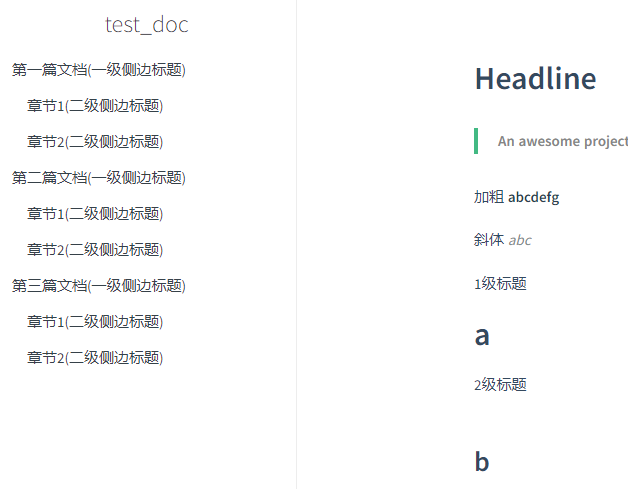

但是此时的侧边内容渲染呈现了**多级的效果**，但是还不能点击——这是因为，我们的列表单元还不是一个**链接**，渲染出来的只是一个**文本**而已。

## 3.侧边支持点击

我们这样修改之前的`_sidebar.md`为以下形式:

```markdown
- [第一篇文档(一级侧边标题)]()
	- [章节1(二级侧边标题)]()
	- [章节2(二级侧边标题)]()
- 第二篇文档(一级侧边标题)
	- 章节1(二级侧边标题)
	- 章节2(二级侧边标题)
- 第三篇文档(一级侧边标题)
	- 章节1(二级侧边标题)
	- 章节2(二级侧边标题)
```

效果如下:

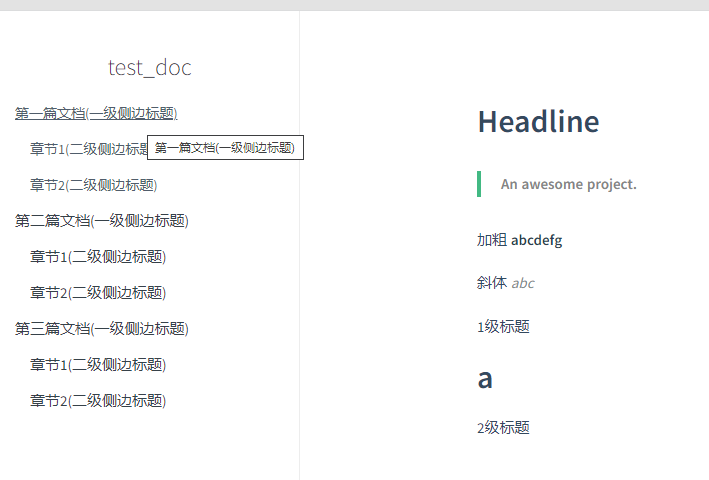

此时，修改后的前三个侧边内容就**支持点击**啦，不过由于**没有配置链接内容**，因此**默认**跳转到**`主页`**——也就是跳转浏览`README.md`内容。

让侧边支持点击只需要将原本的文档内容改成以下格式即可:

```markdown
[文本内容](链接)
```

## 4.结合Markdown完善侧边栏

上边，我们可以清楚侧边栏内容的渲染是依据`_sidebar.md`中的**列表单元**来实现的，而**点击功能**则是`将文本内容变成链接`——而**链接到哪儿**，就是本节要做的工作，也是进一步完善侧边栏的指导内容。

现在，我们创建一个**文件夹**，放在`docs`目录下，用来存我们文档中的一些具体文档信息。

如下:


接着，我们在里边创建`3`个**`Markdown`**文件，分别对应前面的`三个链接`(侧边栏的内容/项).

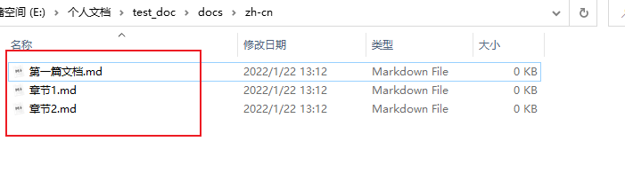

接下来，我们回到_sidebar.md文件中，把之前的**空链接**，补成**本地的文档链接**:

改动前:

```markdown
- [第一篇文档(一级侧边标题)]()
	- [章节1(二级侧边标题)]()
	- [章节2(二级侧边标题)]()
```

改动后:（不必指出`文件后缀`，只需输入**对应的路径以及文件名**即可）

```markdown
- [第一篇文档(一级侧边标题)](./zh-cn/第一篇文档)
	- [章节1(二级侧边标题)](./zh-cn/章节1)
	- [章节2(二级侧边标题)](./zh-cn/章节2)
```

效果如下:

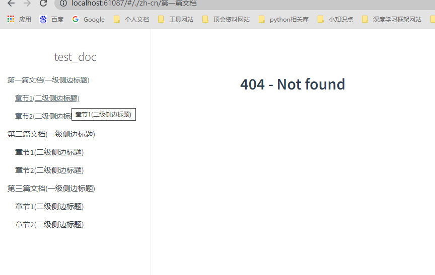

> 将**链接指向本地或者具体的文档**后，侧边栏的功能就可以实现了——通过点击实现指定文档内容的浏览。

现在显示`404-Not found`，是因为对应链接的`Markdown`文件为**空**，没有内容用于渲染。

我们向刚创建的三个Markdown文件里分别添加一句内容:

```markdown
- 待更新 （文件名）
```

现在的效果如下:


这样的话，以后我们就可以将文章中**各个部分**分别写到**多个`Markdown`文件**中，然后编辑侧边栏(`_sidebar.md`)进行`链接`即可！

到这里侧边栏的基本功能就搞定了。

## ★ 侧边栏建议/补充


- 1. 侧边栏渲染文件，默认为`_sidebar.md`。

  - 如果不使用默认文件/或其它应用部署时渲染不支持下划线文件，则可以替换如下:

    - 默认侧边栏渲染规则(配置):

      - html: 

        - ```html
          <div id="app"></div>
          <script>
              window.$docsify = {
                name: 'test_doc',
                repo: 'http://www.baidu.com/',
                maxLevel: 2,
          	  loadSidebar: true,
              }
          </script>
          ```

      - 渲染文件:
      
    - `_sidebar.md`
  
- 自定义侧边栏渲染规则(配置):
  
  - html:
    
        - ```html
          <div id="app"></div>
          <script>
              window.$docsify = {
                name: 'test_doc',
                repo: 'http://www.baidu.com/',
                maxLevel: 2,
          	  loadSidebar: './sidebar.md',
              }
          </script>
      ```
    
      ```
    
  - 渲染文件:（与上边配置的路径(`./sidebar.md`)一致哦）
    
        - `sidebar.md`

* 2. `_sidebar.md`中的表单级数尽量不超过`2`级。

  * 即: **至多如下**:

    * ```markdown
      - 第一级
      	- 第二级
      - 第一级
      	- 第二级
      ```

* 3. 支持**侧边内容/目录收缩**的实现——依赖链接的`Markdown`的**标题**与`subMaxLevel`的**限制**。

  * 先添加`subMaxLevel: 2`到`index.html`中（开启**子目录渲染级**——将`2`级标题渲染为子目录） -- **设置为多少，就将哪一级标题渲染为子目录**

    * ```html
      <div id="app"></div>
      <script>
          window.$docsify = {
              name: 'test_doc',
              repo: 'http://www.baidu.com/',
              maxLevel: 2,
              subMaxLevel: 2,
              loadSidebar: true,
          }
      </script>
      ```

  * 将第4小节的三个文档都添加以下修改:

    * ```markdown
      # 1.文档说明
      
      ## 1.1 API介绍
      
      ### 1.1.1 API功能
      
      ### 1.1.2 API源码
      
      ## 1.2 API使用建议
      ```

  * 效果如下:

    * 点击前:
      * 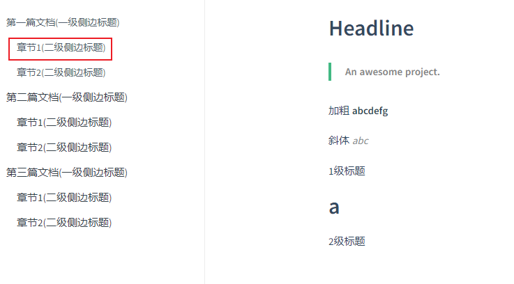
    * **点击后:**
      * 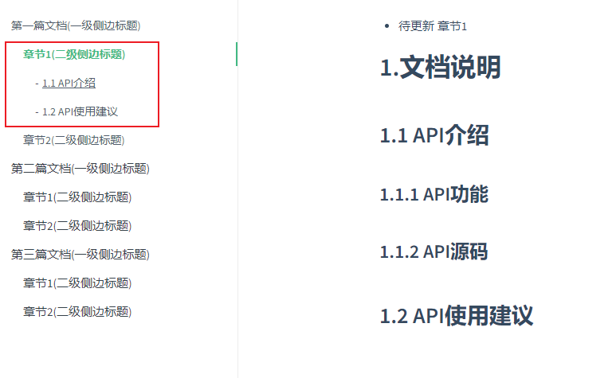

    - 可以看出，通过添加`subMaxLevel`之后，`docsify`会自动将所`链接Markdown文本`里的**二级标题渲染**为子目录，当点击对应的链接时，就会实现**自动展开的效果**啦。
    
    - > `1`级列表单元链接的文档子目录渲染效果如下，会对`章节2`展开产生一定的影响。
    
      - 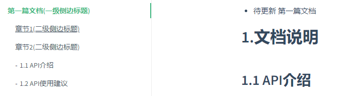
      - 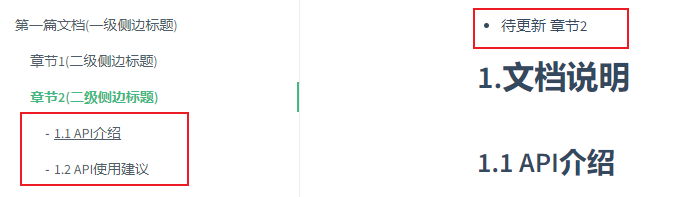

* 4. 建议对`_sidebar.md`中的`1`级列表单元使用纯文本(`个人习惯`)。

  * ```markdown
    - 第一级1
    	- [第二级]()
    	- [第二级]()
    - 第一级2
    	- [第二级]()
    	- [第二级]()
    ```

  * 之所以这样写，是因为我们可以将一个大章节的内容以及标题直接显示，然后把每一个内容单独写一个Markdown进行细分，然后对每一个Markdown再支持目录收缩，从而方便阅读。

    * **第一级不收缩**，可以直观的看到每一节有哪些内容
    * **第二级收缩**，可以便捷跳转到指定章节内的一些内容
  
* 5. 建议在_sidebar.md中添加侧边栏链接选项时，补充文档页面名称。

  * 当前链接选项/侧边栏情况:

    * 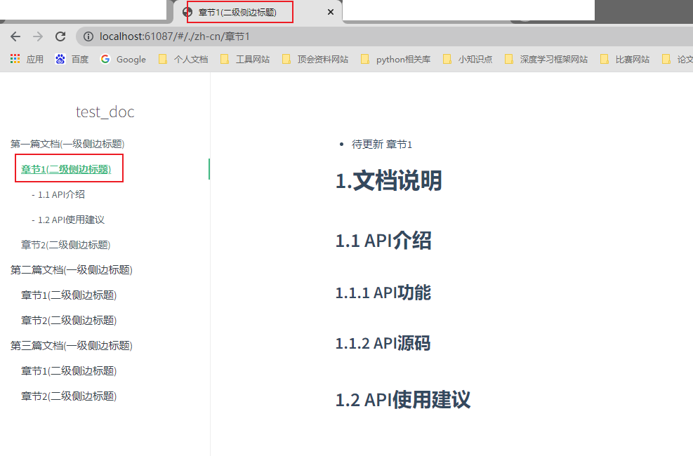

    * 可以看出，当点击跳转到指定文档浏览后，网页/文档页面的标题也变了，因此——需要固定一下页面标题，这样会好看一些。(自己写来阅读的文档其实不设置也没有影响的哦~)

  * 完善措施:(这里，我们文档名始终定为: `test_doc`)

    * 在_sidebar.md中，添加链接项时，添加一下文档页面名称

      * ```markdown
        - 第一篇文档(一级侧边标题)
            - [章节1(二级侧边标题)](./zh-cn/章节1 "test_doc")
            - [章节2(二级侧边标题)](./zh-cn/章节2 "test_doc")
        ```

      * 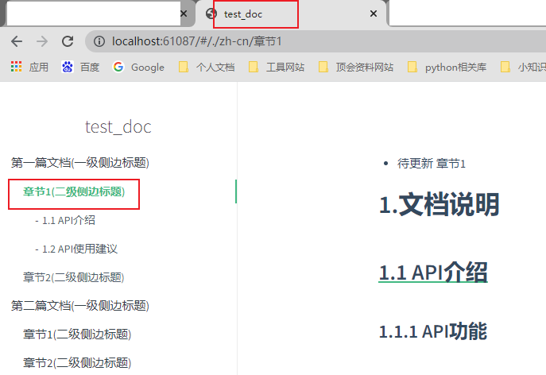


> 如有疑惑，或是错误的地方还望指出，一同进步，完善文档的建设~
>
> 欢迎issue哦~


> 侧边栏实现实例，可以点击**右上角图标**参考本文档的实现.