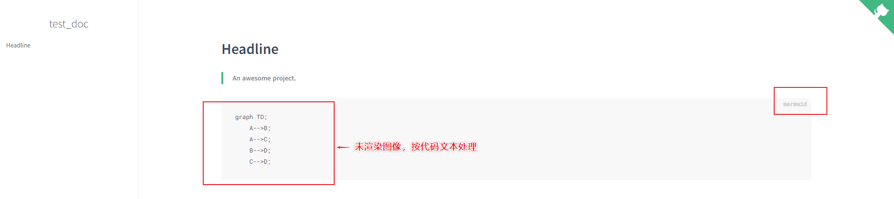
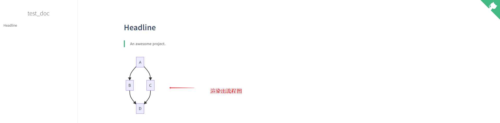

<center><font size=32>为文档添加Mermaid功能</font></center>

## 1.功能介绍

在进行`Markdown`文档撰写过程中，有时候需要进行一些简单的`流程图/UML`等的绘制。如果每次遇到这种需求都单独使用一些工具来绘制，然后**导出/截图**的话，工作量肯定很大了。在写文档的时候，我们希望越快越好，如果能满足一些简单的流程便捷绘制那就很好啦~

而`Mermaid`这个插件就能实现在本地`Markdown`或者`docsify`中进行一些流程图的**实时渲染**，除了显示图片外，还可以根据实时进行修改——**简单**、**便捷**、**可修改**。

功能表单:

- 支持**流程图**
- 支持**UML**
- 支持**序列图**
- 支持**类图**
- 支持**状态图**
- 支持**简单的饼状图**
- 支持**需求图**
- 支持**实体关系图**
- 支持**图形嵌套**等...

> 更多支持类型可前往[官网](https://mermaid-js.github.io/mermaid/#/flowchart 'target: _blank')查看

## 2.插件所需script


* `Mermaid`对应的`插件1`:

```html
<script src="//unpkg.com/mermaid/dist/mermaid.js"></script>
<script src="//unpkg.com/docsify-mermaid@latest/dist/docsify-mermaid.js"></script>
<script>mermaid.initialize({ startOnLoad: true });</script>
```

* `Mermaid`对应的`插件2`:

  ```html
  <link rel="stylesheet" href="//cdn.jsdelivr.net/npm/mermaid/dist/mermaid.min.css">
  <script src="//cdn.jsdelivr.net/npm/mermaid/dist/mermaid.min.js"></script>
  ```

> 这里提供两个`插件script`，可供选择——目前应用`插件1`运行良好。

## 3.为文档添加script


我们知道所需的**插件script**之后，我们就可以直接添加到`index.html`中，开启相应的功能啦~

我们插入位置为`index.html`尾部:

```html
<!-- Docsify v4 -->
  <script src="//cdn.jsdelivr.net/npm/docsify@4"></script>
  <script src="//unpkg.com/mermaid/dist/mermaid.js"></script>
  <script src="//unpkg.com/docsify-mermaid@latest/dist/docsify-mermaid.js"></script>
  <script>mermaid.initialize({ startOnLoad: true });</script>
</body>
</html>
```

我们可以先看一下，未插入**Mermaid插件**前的`mermaid`绘图代码执行情况:

- 在`README.md`文件中写入以下`Markdown`语法(mermaid渲染是从代码块中读取来实时渲染的，跟普通的Markdown代码块一样用)

  - ```markdown
    ​```mermaid
    graph TD;
        A-->B;
        A-->C;
        B-->D;
        C-->D;
    ​```
    ```

    效果展示:

    

- 添加插件1后的效果:

  

## 修改后的完整代码

`index.html`中的完整代码:

```html
<!DOCTYPE html>
<html lang="en">
<head>
  <meta charset="UTF-8">
  <title>test_doc</title>
  <meta http-equiv="X-UA-Compatible" content="IE=edge,chrome=1" />
  <meta name="description" content="Description">
  <meta name="viewport" content="width=device-width, initial-scale=1.0, minimum-scale=1.0">
  <link rel="stylesheet" href="//cdn.jsdelivr.net/npm/docsify@4/lib/themes/vue.css">
</head>
<body>
  <div id="app"></div>
  <script>
    window.$docsify = {
      name: 'test_doc',
      repo: 'http://www.baidu.com/',
    }
  </script>
  <!-- Docsify v4 -->
  <script src="//cdn.jsdelivr.net/npm/docsify@4"></script>
  <script src="//unpkg.com/mermaid/dist/mermaid.js"></script>
  <script src="//unpkg.com/docsify-mermaid@latest/dist/docsify-mermaid.js"></script>
  <script>mermaid.initialize({ startOnLoad: true });</script>
</body>
</html>

```

`README.md`中的完整内容:

```markdown
# Headline

> An awesome project.


​```mermaid
graph TD;
    A-->B;
    A-->C;
    B-->D;
    C-->D;
​```

```

## Mermaid文档链接

- [mermaid文档链接](https://mermaid-js.github.io/mermaid/#/README 'target: _blank')