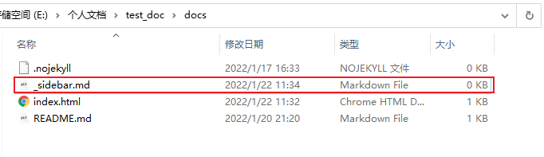
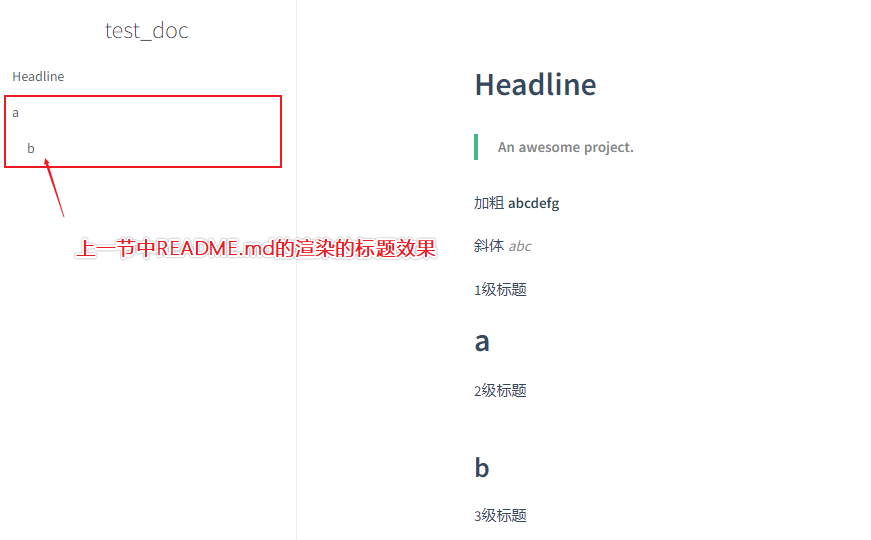

## 1.侧边栏效果

> 对于侧边栏，其实大家应该从前面的`README.md`解析部分就已经看到过相似的效果啦~

比如，本文档的侧边栏:


接下来，我就给大家介绍如何**添加侧边栏**，以及一些**基本的建议**。

## 2.开启侧边栏


要开启侧边栏，我们需要完成`一配置一添加`的操作:

- **一配置**: 在`index.html`中正式配置侧边栏功能，支持**侧边栏构建**
- **一添加**: 在`docs`目录下添加`_sidebar.md`文件，完善**侧边栏内容**

首先，我们先到`index.html`中配置以下指令:

```html
loadSidebar: true
```

**具体添加位置**:

```html
<div id="app"></div>
<script>
    window.$docsify = {
        name: 'test_doc',
        repo: 'http://www.baidu.com/',
        maxLevel: 2,
        loadSidebar: true,
    }
</script>
```

接着，我们添加一个文件`_sidebar.md`到`docs`目录下:



然后我们看一下**文档服务启动**后的效果:



可以看出，现在虽然完成了侧边栏的开启与侧边栏渲染所需的 `_sidebar.md` 文件，但由于 `_sidebar.md`是**空**的，所以没有效果。

具体侧边栏配置，我们在下一节介绍~


> 侧边栏实现实例，可以点击**右上角图标**参考本文档的实现.