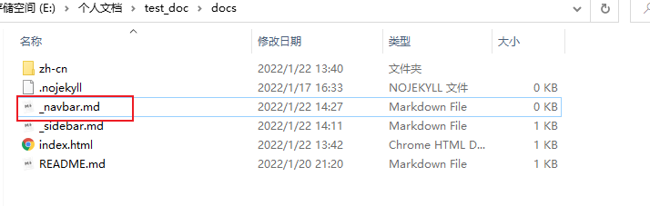

## 1.导航栏效果

导航栏的效果简单来说就是这样哒~


鼠标滑动过去，就可以直接看着一些选项，可以**快捷跳转**，作为**侧边栏的补充**啦~

是不是发现文档更方便了呢？其实到这里，我们完全可以把`docsify`的文档做成我们的**个人简单博客**，除了**评论功能**需要支持麻烦一点，其它的简单功能还是可以满足哒~


> 注意，这里我将搜索栏功能添加移除了，因为是对文档中的链接进行查询，所以对于前期用处不大，因此我会后边整理一下进阶内容后重新上传~
>
> Update: 2022.1.22

## 2.开启导航栏

导航栏的开启与侧边栏类似:

- **一配置**: 在`index.html`中正式配置导航栏功能，支持**导航栏构建**
- **一添加**: 在`docs`目录下添加`_navbar.md`文件，完善**导航栏内容**

首先，我们先到`index.html`中配置以下指令:

```markdown
loadNavbar: true
```

**具体添加位置:**

```html
<div id="app"></div>
<script>
    window.$docsify = {
        name: 'test_doc',
        repo: 'http://www.baidu.com/',
        maxLevel: 2,
        subMaxLevel: 2,
        loadSidebar: true,
        loadNavbar: true,
    }
</script>
```

接着，我们添加一个文件`_navbar.md`到`docs`目录下:



> 这时候直接启动服务查看是没有效果哒~

向`_navbar.md`添加以下内容:(**使用类似侧边栏**)

```markdown
- 常见问题(Q&A)
- 学习资料
```

然后我们看一下**文档服务启动**后的效果:


到这里基本上完成了导航栏的开启与导航栏渲染所需的 `_navbar.md` 文件创建

具体导航栏配置与使用，我们在下一节介绍~

> 导航栏实现实例，可以点击**右上角图标**参考本文档的实现.