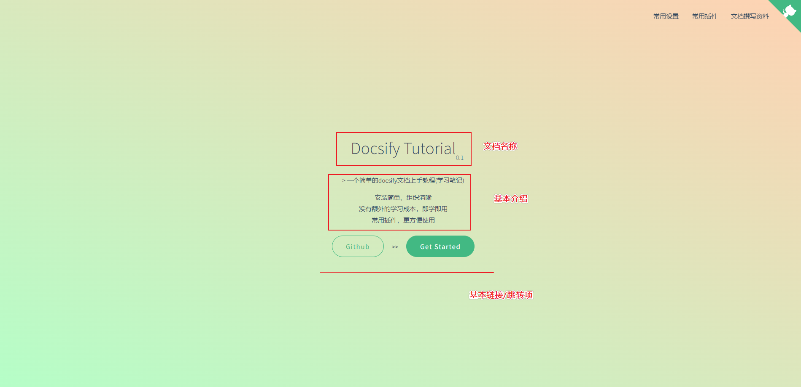
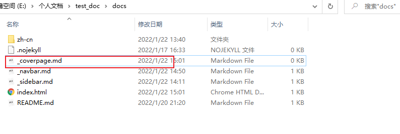
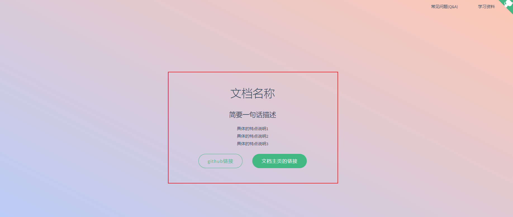

## 1.封面效果

封面的效果是这样哒~



通过点击`Get Started`就可以开启文档的阅读，跳转到**指定的链接页面**——一般为主页(`README.md`)。

## 2.封面开启


封面的开启与导航栏类似:

- **一配置**: 在`index.html`中正式配置封面功能，支持**封面构建**
- **一添加**: 在`docs`目录下添加`_coverpage.md`文件，完善**封面内容**

首先，我们先到`index.html`中配置以下指令:

```markdown
coverpage: true
```

**具体添加位置:**

```html
<div id="app"></div>
<script>
    window.$docsify = {
        name: 'test_doc',
        repo: 'http://www.baidu.com/',
        maxLevel: 2,
        subMaxLevel: 2,
        loadSidebar: true,
        loadNavbar: true,
        coverpage: true,
    }
</script>
```

接着，我们添加一个文件`_coverpage.md`到`docs`目录下:



向`_coverpage.md`添加以下内容:(一个简单模板)

```markdown
# 文档名称

> 简要一句话描述

- 具体的特点说明1
- 具体的特点说明2
- 具体的特点说明3

[github链接](https://github.com/cjh3020889729) [文档主页的链接](./README.md)
```

效果如下:



> 因此大家可以基于这个模板进行简单的配置说明哦~
>
> 如果没有`github`以及其它的**链接**需要展示，可以只保留**文档链接**~

## 3.封面的基本配置说明

* 1. 封面渲染默认针对文件`_coverpage.md`进行渲染，如需更换文件进行渲染，请参考自定义[侧边栏文件渲染](./zh-cn/完善侧边栏内容?id=★-侧边栏建议补充).

* 2. 建议`_coverpage.md`中链接放在**末尾**，且**不换行**——多个链接间用空格隔开即可。

  * `docsify`仅对**最后一行的链接**进行美观渲染，其它行的链接只是纯文本格式——美观度不太好~

* 3. 文档封面`背景图片`/`背景颜色`可指定。

  * **背景图片**: 直接在`_coverpage.md`文档中配置即可:(添加在该文档的末尾)

    * ```markdown
      
      ```

  * **背景颜色**: 直接在`_coverpage.md`文档中配置即可:(添加在背景图片之后/文档的末尾)

    * ```markdown
      
      ```

    * > 完成以上配置，`docsify`会自动渲染完成封面构建~


> 封面实现实例，可以点击**右上角图标**参考本文档的实现.