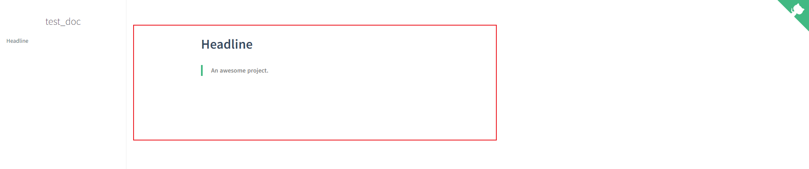
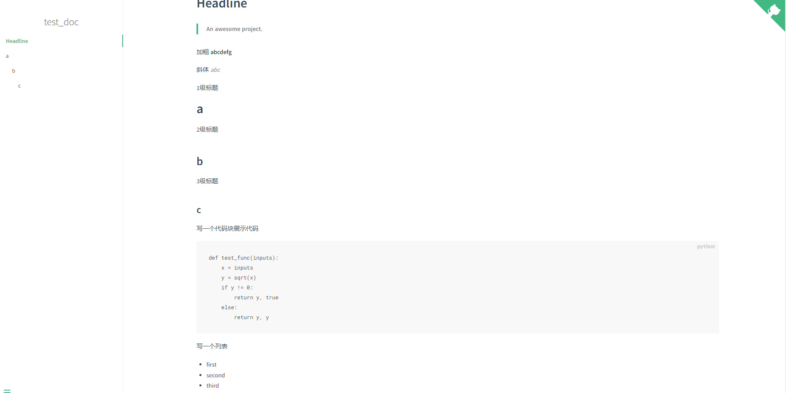
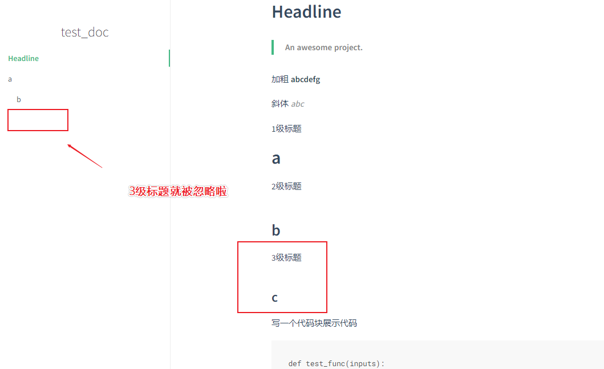
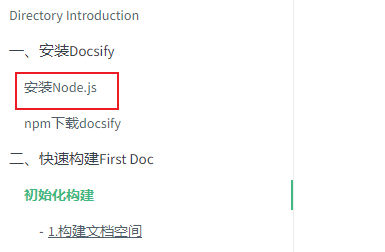
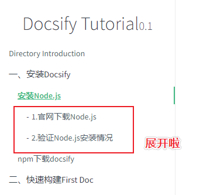

## 1.README作用

上面我们简单解析了`index.html`的作用以及可以通过设置它得到什么样的**效果**。那么接下来，我们就来了解下另外一个 _主要的内容_ ——`README.md`文件。

首先说明，`README.md`中的内容就是`docsify`文档渲染中主页内的内容——换言之，**README.md中写了什么，咱的文档主页就显示什么**。

## 2.README效果


默认的`README.md`的内容如下:

```markdown
# Headline

> An awesome project.

```

> 暂时咱还不知道默认模板内容是不是可不可以自定义，要是可以的话写笔记/技术文档啥的可能就更方便了，哈哈~

对应的效果:



> 不能说一摸一样，除了左侧多了一个侧边栏，右上角多了一个repo链接——最主要还是渲染出来的文档很清晰的~

那我们将以下`Markdown`内容加到`README.md`中，然后让它再显示一下:

```mark
加粗
**abcdefg**

斜体
_abc_

1级标题
# a

2级标题
## b

3级标题
### c

写一个代码块展示代码
​```python
def test_func(inputs):
    x = inputs
    y = sqrt(x)
    if y != 0:
        return y, true
    else:
        return y, y
​```

写一个列表
* first
* second
* third

写一个嵌套列表
* first
	* first-first
	* first-second
	
写一个外部跳转链接
[百度搜索](http://www.baidu.com/ 'target: _blank')

写一个提示语
> Tips/PS: xxxxxxxxx
```

效果如下:



可以看出，渲染效果很好，看起来可以让文档有许多不同的修饰，来方便阅读。

不过，大家可能也看到了我们渲染的界面中，左侧的侧边栏出现了更多的`点击项`，点击的文字描述正好对应我们文档中的**标题**内容。

这是`docsify智能渲染`的一个规则。它会自动将`Markdown`文件中的标题渲染成侧边栏中的**小标题**，可以通过**点击小标题**来快速跳转到**指定的内容位置**。

其实这个部分渲染小标题的等级是可以控制的哦(`默认6级及以内标题都渲染`)——只需要修改一下`index.html`内容，就可以让`docsify`只对一定级别以内的标题进行渲染啦。

比如，我们设置成`两级标题以内`渲染:

`index.html`修改部分如下:

```html
<div id="app"></div>
  <script>
    window.$docsify = {
      name: 'test_doc',
      repo: 'http://www.baidu.com/',
      maxLevel: 2,
    }
  </script>
```

新的演示效果:



通过控制智能渲染的`标题级别`，就可以根据`Markdown`文档内容来更好的`生成小标题`方便阅读啦~

通过`标题智能渲染`，我们就可以实现跟本文档一样的效果啦~

> PS: 不过这里README.md中产生的标题渲染不是我们后边讲到侧边栏的子目录收缩，但原理相似哦~

点击前:



**点击后:**



是不是很方便呢？具体的实现啊，我会在后边介绍侧边栏的时候会给大家细细讲解的🤭

## 3.docsify文档内容来源

前面，其实就将整个docsify生成的基本文档内容进行的简单的介绍与使用，以及一些效果的简单配置。但是有一个文件`.nojekyll`没有具体介绍，因为这个文件主要是为了避免其它的一些实时渲染文档框架对`下划线开头的文件`(eg:_sidebar.md)的忽略，少渲染了一些文件——具体会在`Github`的`Pages服务部署`下进行说明哦~

--------

最后，要给大家说的一点是，`docsify`渲染的内容是基于`Markdown`文件来产生的，因此，大家可以将以前写的一些`Markdown`**文件**/**笔记**/**博客**做**轻微的格式修改**或**不修改**就能在`docsify`渲染下取得一个不错的展示效果啦。


> 总结一句话, 以后我们向初始化文档中添加的文档内容，都是一个个的Markdown文件——所以大家可以学习一下[常用的Markdown语法](https://markdown.com.cn/basic-syntax/)，让自己的文档更加方便自己阅读或是给别人参考。


- 本文档全部采用docsify组织并实现，虽然是挂在Github-Pages上，但是渲染效果与本地是一致的🤭