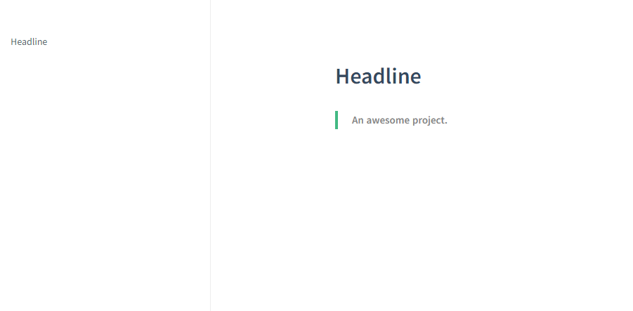
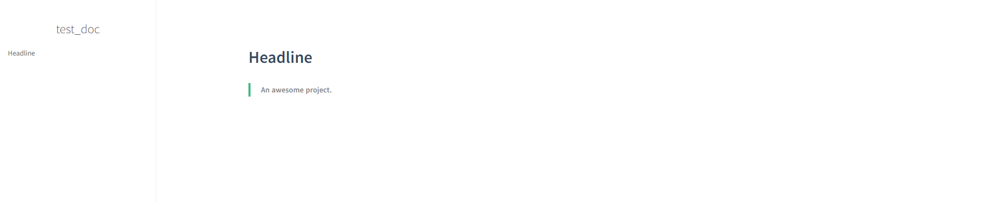
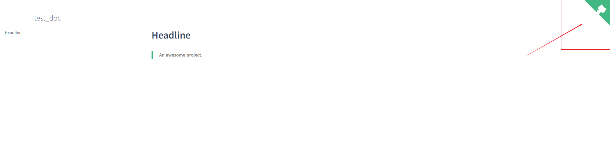
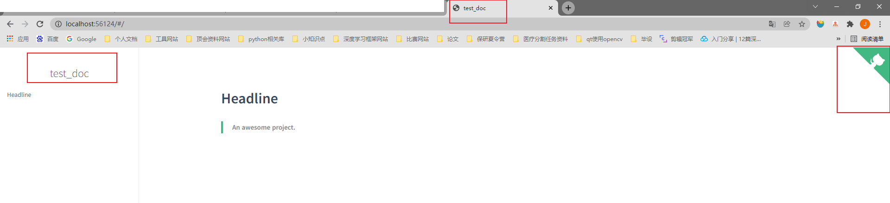

## 1.index.html文档内容

首先，我们来看一下我们的`index.html`文件，看下它的内容以及对应到文档中的作用。

```html
<!DOCTYPE html>
<html lang="en">
<head>
  <meta charset="UTF-8">
  <title>Document</title>
  <meta http-equiv="X-UA-Compatible" content="IE=edge,chrome=1" />
  <meta name="description" content="Description">
  <meta name="viewport" content="width=device-width, initial-scale=1.0, minimum-scale=1.0">
  <link rel="stylesheet" href="//cdn.jsdelivr.net/npm/docsify@4/lib/themes/vue.css">
</head>
<body>
  <div id="app"></div>
  <script>
    window.$docsify = {
      name: '',
      repo: ''
    }
  </script>
  <!-- Docsify v4 -->
  <script src="//cdn.jsdelivr.net/npm/docsify@4"></script>
</body>
</html>
```

> `Windows`上查看`html`文件内容，可以用过`右键鼠标`用**其它打开方式**——选择`记事本`打开即可。z

在`index.html`文件中，我们需要注意的不多，因为整体就是一个标准的html文档，这里我们只关心我们在文档过程中经常会用到的内容。

- ```html
  <title>Document</title>
  ```

  - 这里的`<title></title>`是html中的标签语法，两者中间的内容就是我们主页的名称啦(`There is Document.`)——我们可以根据需要进行设定。
  - 

- ```html
  <script>
      window.$docsify = {
        name: '',
        repo: ''
      }
    </script>
  ```

  - 这里`<script></script>`标签里的`window.$docsify`是后期我们进行文档插件配置的地方。这里目前只有**两个参数**，`name` + `repo`。_这里默认为空，就是没有添加相应的效果。_

## 2.name的作用


为了更好的说明，我们来尝试着**修改**一下`name`来看下**对比效果**~(`change as test_doc`)

- 修改前:
- 

- **修改后:**
- 

- 所以，`name`的作用就是给文档左侧侧边栏添加名称的作用~

  - ```htm
    name: 'test_doc'
    ```

- > PS: 它是支持点击的哦~， 具体点击后的**跳转链接**默认为`"/"`, 一般就是回到**文档主页**。

  - 如果需要配置**其它链接**作为`name`的**跳转链接**，可以通过`nameLink`配置来实现。

  - ```html
    window.$docsify = {
      name: 'test_doc',
      nameLink: 'http://www.baidu.com/',
      repo: ''
    };
    ```


## 3.repo的作用


- 我们再来看看`repo`的作用~，我们设置`repo`为自己的**`github`链接/任意链接**也可以的。

  - 修改前:
  - 

  - **修改后:**(这里修改为: `http://www.baidu.com/`)
  - 

  - 所以，`repo`的作用就是在**右上角**添加一个可点击的**链接标签**——这里一般都是放的`github`链接，当然大家也可以按自己喜好去设置链接~

    - ```html
      repo: 'http://www.baidu.com/'
      ```

所以我们试着修改上面提到的三个部分: `title` + `name` + `repo`

得到的效果如下: (`change title as test_doc`)



到这里，大家应该就清楚目前`index.html`可以实现的一些**基本功能**啦。

后面，再介绍一下`README.md`之后就可以正式开始文档修饰之路啦——`完善侧边栏`部分的内容就是文档组织实现的部分介绍了。